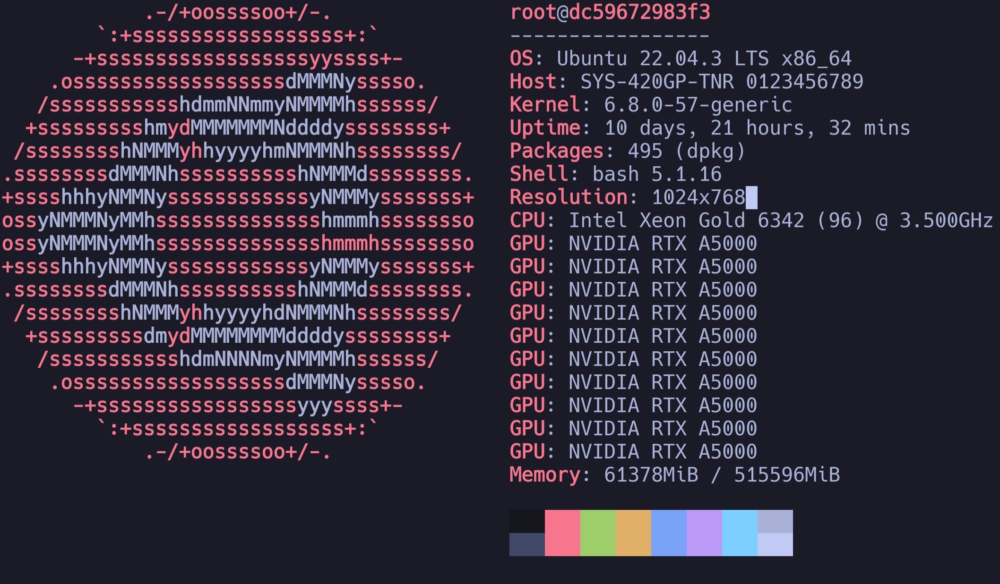
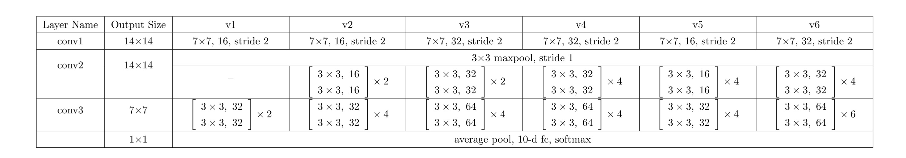
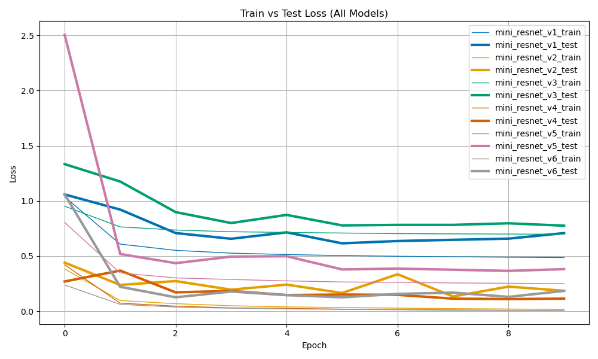
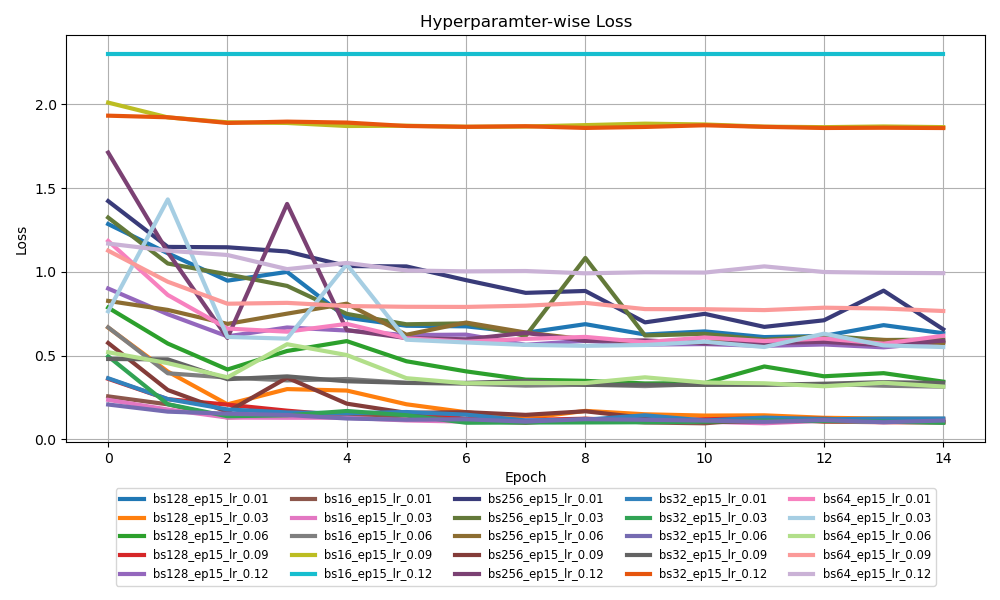
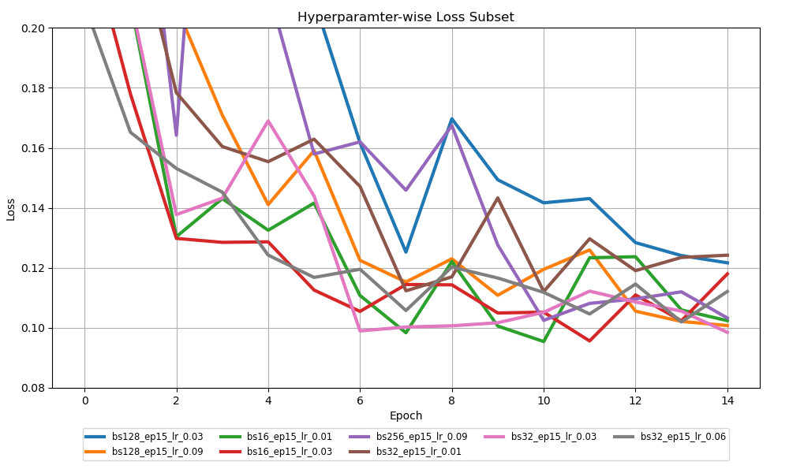
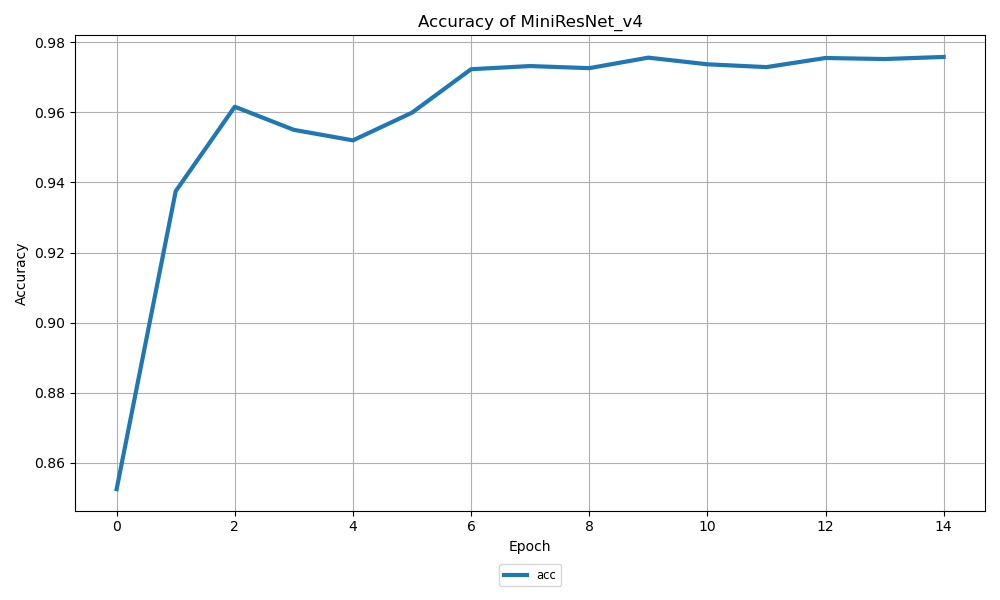

# Overview


이미지 인식 모델을 어떻게 설계해야하는 지 알아보는 프로젝트 입니다.  기존의 이미지 인식 모델을 분석하고 이를 기반으로 KMIST 데이터를 분류하는 신경망을 설계합니다.

이 프로젝트에는 두 가지 서브 목표가 있습니다.

1. Alex&ResNet(AlexNet과 ResNet 구조 분석)

ImageNet 분류작업에서 뛰어난 성능을 보인 AlexNet과 ResNet의 구조를 분석합니다. AlexNet과 ResNet을 분석하는 이유는 다음과 같습니다.

- AlexNet은 신경망의 깊이에 따라 필터의 커널과 스트라이드 크기를 다르게 했습니다. AlexNet을 통하여 이미지 인식과 필터의 관계를 알아봅니다.
- ResNet은 2015년에 ImageNet분류에서 우승한 모델입니다. ResNet에는 Skip Connection이라는 구조가 있는데 이 구조는 현재도 자주 사용되고 있습니다. 이 프로젝트에서는 경량화 된 ResNet18을 실제로 구현합니다.

2. MiniResNet(KMIST 데이터 분류 신경망 설계 및 구현)

모델 분석을 바탕으로 KMIST데이터를 효과적으로 분류하기 위한 모델을 설계합니다.

### Previous Future Work

이 프로젝트는 dl-basic프로젝트의 후속 프로젝트이며 이전 프로젝트의 Future Work의 일부를 다룹니다. 

- Apply special layers.
    - Batch normalization
- Use tqdm library for recording.
- Use other models.
    - ResNet, UNet, Transformer etc

### References

AlexNet과 ResNet의 구조는 아래의 논문들을 참고 했습니다.

1. Krizhevsky, A., Sutskever, I., & Hinton, G. E. (2012). ImageNet classification with deep convolutional neural networks. Advances in neural information processing systems, 25, 1097-1105.
2. He, K., Zhang, X., Ren, S., & Sun, J. (2016). Deep residual learning for image recognition. Proceedings of the IEEE conference on computer vision and pattern recognition (CVPR), 770–778.

# Enviornment


### Development Environment



Ubuntu  22.04.3 LTS with NVIDIA RTX A5000

### Project Information

| Task Type | Classification |
| --- | --- |
| Data | KMNIST |
| Loss | CrossEntropy |
| Optimizer | SGD |

### Dataset

| Data | Japanese Charactors(Hiragana) |
| --- | --- |
| Train Data | 60,000 |
| Test Data | 10,000  |
| Size | 28 x 28 |
| Class | 10 |

### Entire Directory Structure

```python
resnet-implementation
├── README.md
├── config
│   └── default.yaml
├── data
│   ├── __init__.py
│   └── loader.py
├── experiments
├── grid_search.py
├── main.py
├── models
│   ├── __init__.py
│   ├── mini_resnet.py
│   ├── resnet.py
├── requirements.txt
├── train
│   ├── __init__.py
│   └── trainer.py
├── utils
│   ├── __init__.py
│   └── misc.py
└── visualize.py

```

# Alex&ResNet


### AlexNet

|  | Kerenl | Stride | Padding | Channels |
| --- | --- | --- | --- | --- |
| Conv 1 | 11 x 11 | 4 | 0 | 96 |
| Conv 2 | 5 x 5 | 1 | 2 | 256 |
| Conv 3 ~ 5 | 3 x 3 | 1 | 1 | 384 |

AlexNet consists of  5 Conv layer + 3 FC layer structure. It use various kernel sizes acoss convolution layers. For each kernel design, there exists purposes for extracting feature efficiently.

Conv 1

- Extracting simple features(edge, color) from a wide receptive field.
- Rapidly reduces the spatial resolution of the input.
- Use fewer channels since input contains rich row information.

Conv 2

- Focuses on extracting more detailed features.

Conv 3~5

- Captures fine-grained and abstract features.
- Increasing the number of channels to handle higher-level representations(shape, substructure).

### ResNet

|  | Output Size | Structure |
| --- | --- | --- |
| Conv 1 | 112 x 112 | 7 x 7 Conv, 64, stride 2 + max pool |
| Conv 2_x | 56 x 56 | Two Residual Block, 64 |
| Conv 3_x | 28 x 28 | Two Residual Block, 128 |
| Conv 4_x | 14 x 14 | Two Residual Block, 256 |
| Conv 5_x | 7 x 7 | Two Residual Block, 512 |
|  | 1 x 1 | Average Pooling , 10-d FC layer |

ResNet consists of convolutional layers and skip connections. There are several variants of ResNet. I focus on ResNet18, which has 18 layers.

Convolution Layer Base

- Decreasing feature by the first layer, and repeating 3 x 3 kernel

```python
class ResNet(nn.Module):
    def __init__(self):
        super().__init__()
        self.conv1 = nn.Conv2d(in_channels=1, out_channels=64, kernel_size=7, stride=2, padding=3)
        self.bn1 = nn.BatchNorm2d(64)
        self.maxpool = nn.MaxPool2d(kernel_size=3, stride=2, padding=1)

        self.layer1 = self._build_layer(64, 64)
        self.layer2 = self._build_layer(64, 128)
        self.layer3 = self._build_layer(128, 256)
        self.layer4 = self._build_layer(256, 512)

        self.avepool = nn.AdaptiveAvgPool2d((1, 1))
        self.fc1 = nn.Linear(512, 10)
        self.relu = nn.ReLU()

    def _build_layer(self, in_channels, out_channels):
        layers = []
        layers.append(ResidualBlock(in_channels, out_channels))
        layers.append(ResidualBlock(out_channels, out_channels))

        return nn.Sequential(*layers)

    def forward(self, x):
        x = self.conv1(x)
        x = self.bn1(x)
        x = self.relu(x)
        x = self.maxpool(x)
        
        x = self.layer1(x)
        x = self.layer2(x)
        x = self.layer3(x)
        x = self.layer4(x)
        
        x = self.avepool(x)
        
        x = x.reshape(x.shape[0], -1)
        x = self.fc1(x)
        x = self.relu(x)

        return x
```

Residual Block

- Add previous input to output.
- Prevent gradient vanishing in deep model.

```python
class ResidualBlock(nn.Module):
    def __init__(self, in_channels, out_channels):
        super().__init__()
        stride = 1
        self.skip = nn.Sequential()

        if in_channels != out_channels:
            stride = 2
            self.skip = nn.Sequential(
                nn.Conv2d(in_channels=in_channels, out_channels=out_channels, kernel_size=1, stride=2, padding=0)
            )

        self.block = nn.Sequential(
            nn.Conv2d(in_channels=in_channels, out_channels=out_channels, kernel_size=3, stride=stride, padding=1),
            nn.BatchNorm2d(out_channels),
            nn.ReLU(),
            nn.Conv2d(in_channels=out_channels, out_channels=out_channels, kernel_size=3, stride=1, padding=1),
            nn.BatchNorm2d(out_channels)
        )
        self.relu = nn.ReLU()

    def forward(self, x):
        x = self.skip(x) + self.block(x)
        x = self.relu(x)

        return x
```

### Heuristic Design

AlexNet was designed using heuristic rules, applying different kernels and strides for each layer. On the other hand, ResNet adopted a repeated sturcture with residual blocks composed of 3 x3 kernels. It minimizes heuristics in its architectural design compared to AlexNet.

In the practice, ResNet shows superior performance. On the ImageNet task, ResNet got a 3.6% top-5error rate, outperforming human-level accuarcy and performing five times better than AlexNet. Other models such as VGG and GoogLeNet also surpassed AlexNet by focusing on  structural regularity rather than handcrafted feature extraction heuristics.

Heuristic-based design can be  problematic. Model designed heuristically could overfit to specific datasets. It’s performance may decrease when the data distribution shifts. Also it could be harder to analyze and optimize due to their irregular structure.

# MiniResNet


### Model Archtecture

I designed the model using Convolution Layer and  Residual Layer to recognize the KMNIST data. I built four  models to find an optimal model by increasing model capacity.

These models are named as MiniResNet_v1 through MiniResNet_v6. Higher versions of model has deeper structures.



Archtectures of models

There are common structures among models. 

- There is Conv1 layer as the first layer. This layer provides an overview before processing the image using 7 x 7 kernel. It reduces image from 28 x 28 to 14 x 14.
- Also there is maxpooling right after Conv1. It makes the model robust to  small variations of images.
- After multiple Residual Blocks, I adopted average pooling like ResNet. It reduces the number of parameters and the feature dimensionality.

I trained the models under the condition such that

- batch_size: 64
- epochs: 10
- learning rate: 0.05
- seed: 42



Loss graphs generated by mini_resnet models. In the plot, thin line is train loss and bold line is test loss. The mini_resnet_v4(red) shows the lowest loss. 

Over 10 epochs, MiniResNet_v4 is the best model. It has very similar archtecture to ResNet18.

Before training, I expected that a much smaller model would be sufficient compared to ResNet-18, since KMNIST is a much simpler dataset than ImageNet. In practice, however, MiniResNet_v4, despite its relatively deep structure, showed the highest accuracy. This suggests that residual blocks play a significant role in improving performance, even in compact models.

- Entire Code of MiniResent_v4
    
    ```python
    class MiniResNet_v4(nn.Module):
        # Sora
        def __init__(self):
            super().__init__()
            self.conv1 = nn.Conv2d(in_channels=1, out_channels=32, kernel_size=7, stride=2, padding=3)
            self.bn1 = nn.BatchNorm2d(32)
            self.maxpool = nn.MaxPool2d(kernel_size=3, stride=1, padding=1)
    
            self.layer1 = self._build_layer(32, 32)
            self.layer2 = self._build_layer(32, 32)
            self.layer3 = self._build_layer(32, 64)
            self.layer4 = self._build_layer(64, 64)
    
            self.avepool = nn.AdaptiveAvgPool2d((1, 1))
            self.fc1 = nn.Linear(64, 10)
            self.relu = nn.ReLU()
    
        def _build_layer(self, in_channels, out_channels):
            layers = []
            layers.append(ResidualBlock(in_channels, out_channels))
            layers.append(ResidualBlock(out_channels, out_channels))
    
            return nn.Sequential(*layers)
    
        def forward(self, x):
            x = self.conv1(x)
            x = self.bn1(x)
            x = self.relu(x)
            x = self.maxpool(x)
            
            x = self.layer1(x)
            x = self.layer2(x)
            x = self.layer3(x)
            x = self.layer4(x)
            
            x = self.avepool(x)
            
            x = x.reshape(x.shape[0], -1)
            x = self.fc1(x)
            x = self.relu(x)
    
            return x
    
    ```
    

### Hyperparameter Tuning

After selecting MiniResNet_v4 as the model for this project, I planned to fine-tune it by adjusting hyperparameters. For this purpose, I used grid search.

I experimented with five different batch sizes and five learning rates, resulting in a total of 25 combinations.

- Candidate of hyperparameters
    
    
    | Batch Size | 16 | 32 | 64 | 128 | 256 |
    | --- | --- | --- | --- | --- | --- |
    | Learning Rate | 0.12 | 0.09 | 0.06 | 0.03 | 0.01 |
    | Epochs | 15 |  |  |  |  |



Test loss per hyperparameters.

|  | 16 | 32 | 64 | 128 | 256 |
| --- | --- | --- | --- | --- | --- |
| 0.01 | 0.1024 | 0.1242 | 0.6181 | 0.6335 | 0.6568 |
| 0.03 | 0.1180 | 0.0985 | 0.5511 | 0.1217 | 0.5950 |
| 0.06 | 0.3143 | 0.1121 | 0.3149 | 0.3443 | 0.5751 |
| 0.09 | 1.8648 | 0.3366 | 0.7664 | 0.1008 | 0.1033 |
| 0.12 | 2.3027 | 1.8594 | 0.9924 | 0.5809 | 0.5888 |

### Result

I selected best 8 combinations, and plot the graph below.



Loss graph per hyperparameters which are top 8 of entire combination.  The bs32_ep15_lr_0.03 is the fastest one that converges to 0.1 loss.

The best Model shows 0.97 accuracy in bs32_ep15_lr_0.03. 



Accuracy graph of MiniResNet_v4. bs32_ep15_lr0.03. The model achieved 0.97 score.

# Future Works


- Use other archtecture. (U-Net, Drop-Out)
- Deal with other type tasks. (Text, Voice or Video)
